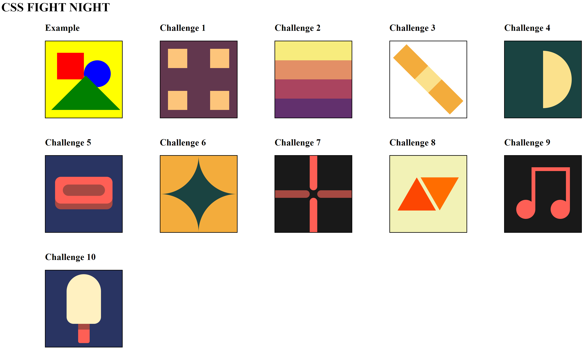

# **Beginner Challenges**

## **Challenge 1:**
- Colours:
	- Background: #62374e
	- Squares: #fdc57b

## **Challenge 2:**
- Colours:
	- Top Layer: #f7ec7d
	- Layer 2: #e38f66
	- Layer 3: #aa445f
	- Layer 4: #62306d

## **Challenge 3:**
- Colours:
	- Sides: #f3ac3c
	- Middle: #fbe18c

## **Challenge 4:**
- Colours:
	- Circle: #fbe18c
	- Background: #1a4341

## **Challenge 5:**
- Colours:
	- Background: #1a4341
	- Lowered Area: #fe5f55
	- Shadow: #a64942

## **Challenge 6:**
- Colours:
  - Middle: #1a4341
  - Edges: #f3ac3c

## **Challenge 7:**
- Colours: 
  - Background: #191919
  - Vertical: #fe5f55
  - Horizontal: #a64942

## **Challenge 8:**
- Colours:
  - Background: #f2f2b6
  - Left: #fd4602
  - Right: #ff6d00

## **Challenge 9:**
- Colours:
  - Background: #191919
  - Note: #fe5f55

## **Challenge 10:**
- Colours:
  - Background: #293462
  - IceCream: #fff1c1
  - Stick: #fe5f55
  - Shadow: #a64942